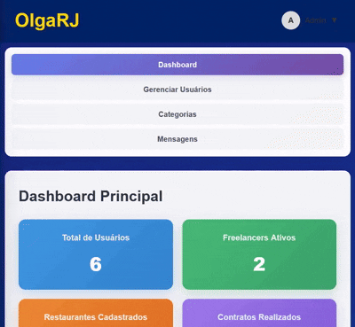

# OlgaRJ – Freelance Platform for Restaurants

## Visão Geral

O **OlgaRJ** é uma plataforma de freelancing inovadora, focada no setor de restauração, desenvolvida para **facilitar a ponte entre gerentes de restaurantes e profissionais que buscam trabalhos flexíveis (part-time ou contratos curtos)**.

No setor da restauração em Portugal, é comum que profissionais acumulem múltiplos empregos de meio período. O OlgaRJ resolve essa dor de cabeça, permitindo que restaurantes encontrem talentos confiáveis e freelancers gerenciem sua disponibilidade e serviços com facilidade.

O projeto foi desenvolvido como parte de um **trabalho académico de Engenharia de Software**, com alta nota, demonstrando domínio completo de **PHP, SQLite e front-end vanilla (HTML, CSS, JavaScript)**.


---

## Tecnologias Utilizadas

- **Front-end:** HTML, CSS, JavaScript (Vanilla)
- **Back-end:** PHP
- **Banco de Dados:** SQLite (com triggers, views e integridade relacional)
- **Metodologia:** Agile Scrum
- **Ferramentas auxiliares:** UML para modelagem, prototipagem no Figma

---

## Funcionalidades Principais

### Para Freelancers:
- Criar, editar e gerenciar serviços detalhados (categoria, preço, descrição, imagens).
- Definir horários de disponibilidade flexíveis.
- Receber mensagens em tempo real de clientes interessados.
- Avaliações vinculadas a contratos concluídos para garantir credibilidade.
- Histórico de contratos e feedbacks.
- **Visualização de um serviço específico**
  


### Para Restaurantes:
- Buscar profissionais com filtros avançados: anos de experiência, disponibilidade, preço, habilidades.
- Visualizar perfis completos dos freelancers, incluindo ratings, idiomas e especializações.
- Contratar serviços e acompanhar status de contratos.
- Mensagens diretas antes de fechar contratos.

### Para Administradores:
- Gerenciar usuários e funções (promover a admin, banir usuários).
- Adicionar ou remover categorias de serviços.
- Painel de controle com estatísticas detalhadas: novos registros, serviços mais solicitados, contratos e transações.



### Funcionalidades Extras:
- Sistema de chat em tempo real com indicadores de digitação.
- Triggers e views no banco de dados garantindo integridade e atualização automática de médias e contagem de avaliações.
- Avaliações de serviços vinculadas a contratos, garantindo autenticidade.
- Interface limpa e fluida com animações CSS vanilla.


---

## Banco de Dados

O banco de dados foi cuidadosamente projetado para suportar todas as funcionalidades do sistema, com **tabelas, triggers, views e relações complexas**:

- **Users, Roles, UserRoles** – gestão de usuários e papéis.
- **FreelancerProfiles, RestaurantProfiles** – perfis detalhados.
- **Services, Contracts, Payments** – gestão de serviços, contratos e pagamentos.
- **Reviews, Conversations, Messages** – comunicação e feedback.
- Especializações, idiomas e ratings calculados automaticamente.

---

## Metodologia

O desenvolvimento seguiu **Agile Scrum**, com **user stories e sprints flexíveis**, permitindo:
- Planeamento detalhado antes da implementação.
- Prototipagem no Figma.
- Ajustes rápidos de funcionalidades com base em feedback.

---

## Diferenciais do OlgaRJ

- Sistema completo para freelancers, restaurantes e admins.
- Filtros de busca avançados e detalhados.
- Chat em tempo real e avaliações vinculadas a contratos.
- Banco de dados robusto com triggers e views para integridade.
- Painel de administrador detalhado e analytics de uso.
- Interface intuitiva e responsiva.

---

## Como Rodar Localmente

1. Clone o repositório:
```bash
git clone <repo_url>
```
2. Inicialize o banco de dados:
```bash
sqlite3 database/TesteOlga.db < database/Simple.sql
```
3. Inicie o servidor PHP:
```bash
php -S localhost:9000
```
4. Acesse no navegador: `http://localhost:9000`

### Credenciais de Teste
- maria.souza@example.com / password // restaurant
- joao.silva@example.com / password // freelancer
- admin.sistema@example.com / password

## Conclusão

O **OlgaRJ** demonstra domínio completo de **desenvolvimento full-stack**, **banco de dados avançado**, **UX/UI e metodologias ágeis**, sendo um projeto de destaque para apresentação em portfólio ou GitHub para futuras oportunidades de estágio ou emprego.

---

## Contato

- Email: olgarj@hotmail.com   ( fake contacts )
- Telefone: +351 919 766 488  ( fake number ) 
- Localização: Algarve, Portugal ( fake localization )

© 2025 OlgaRJ. Todos os direitos reservados.


